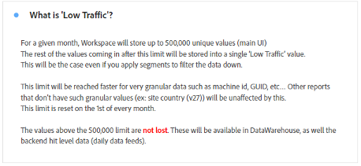
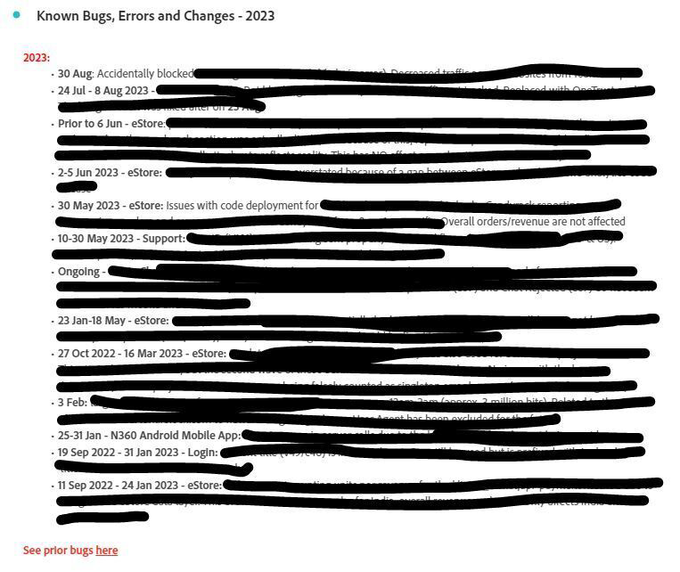

# Création de tableaux de bord opérationnels dans Analysis Workspace

_Découvrez comment les tableaux de bord opérationnels d’Adobe Analytics Workspace offrent une communication et une efficacité révolutionnaires. Découvrez comment créer des FAQ, des actualités, des annonces et des tableaux de bord présentant les derniers bugs et fonctionnalités afin de simplifier la diffusion d’informations, d’offrir une expérience client améliorée et de bénéficier d’un engagement accru._

Comme beaucoup d’administrateurs et d’administratrices, je dirige un centre d’informations interne (Confluence ou similaire) pour Adobe Analytics. Au fil du temps, j’en ai eu assez de répondre aux sempiternelles mêmes questions, et le besoin d’un moyen plus souple d’atteindre mes utilisateurs et mes utilisatrices devenait criant. J’en avais assez d’avoir l’impression de les seriner et de les embêter à longueur de journée. Des référentiels pour des informations moins statiques étaient tout ce dont je rêvais.

J&#39;ai remarqué que les utilisateurs ignoraient souvent mes références au site Confluence, avec des raisons comme « Mon VPN est éteint, » ou « Je ne peux pas le lire maintenant, » etc. En gros, « Je lirai ce document plus tard » signifie qu&#39;il ne sera jamais lu, et la même question sera posée à nouveau la semaine prochaine.

***Eurêka :**&#x200B;la polyvalence de Workspace peut changer la donne. Les réponses rapides et directes dans Workspace sont appréciées de tous, donc ne nous éparpillons pas afin d’éviter des étapes supplémentaires.*

J’ai pris le taureau par les cornes et j’ai créé des tableaux de bord opérationnels pour partager des informations à l’ensemble de l’entreprise. Jusqu’à présent, ces tableaux de bord ont permis de tenir les utilisateurs informés, de centraliser les informations et de réduire la frustration. Ce processus, facile et évolutif, a gagné en efficacité au fil du temps.

Les utilisateurs ont pu obtenir de nombreuses informations utiles sans moi, connaître certaines parties du site, voir à quel point Adobe Analytics est cool et (important pour moi 😊) me poser moins de questions et utiliser moins de temps.

**Je vous recommande vivement de créer des tableaux de bord pour toutes vos propriétés ou zones principales de votre site.** Ils doivent donner un aperçu de la propriété/du site/de l’application/du flux et contenir des informations de base et des informations rapides. Partagez-les avec l’ensemble de l’entreprise afin que tout le monde puisse voler de ses propres ailes et comprendre la propriété sans assistance excessive. Dans ma situation, ces tableaux de bord répondent peu ou prou à 80 % des questions que je reçois et me font gagner un temps précieux.

Libre à vous de conserver votre site Confluence si vous le désirez, il reste un atout précieux. J’y fais même référence en haut de chaque tableau de bord opérationnel. Mais j’adore les raccourcis, à la fois pour moi et pour mes utilisateurs et utilisatrices.

Laissez-moi vous guider dans les trois tableaux de bord opérationnels que j’ai créés pour ma société, GenDigital, qui m’ont aidé à atteindre ces objectifs.

1. Questions fréquentes
1. Actualités et annonces
1. Journal des bugs, des fonctionnalités et des mises à jour majeures

## 1 - Tableau de bord de questions fréquentes

Répéter les mêmes réponses à tout bout de champ vous fatigue ? Arrêtez de le faire. Gagnez du temps en créant un tableau de bord de questions fréquentes. Les utilisateurs et les utilisatrices peuvent le consulter avant de poser une question. Vous pouvez également l’incorporer en un clin d’œil à vos réponses.

Il vous suffit de créer des [visualisations de texte](https://experienceleague.adobe.com/docs/analytics/analyze/analysis-workspace/visualizations/text.html?lang=fr) avec des questions en guise de titre et des réponses et explications pour étayer le contenu, qui sont réduites afin de n’afficher que la question. Regroupez-les par pertinence (par exemple, pages ou produits) ou utilisez des panneaux. Faites preuve de concision et affichez les questions fréquentes dans la partie supérieure.

Au lieu de rédiger de longs e-mails ou de rechercher d’anciennes explications, mettez à jour votre tableau de bord de questions fréquentes. Commencez dès maintenant et enrichissez-le progressivement. Utilisez des hyperliens pour faire référence à d’autres tableaux de bord ou aux questions fréquentes connexes dans les rapports. Offrez davantage de contexte lorsque cela est nécessaire en incorporant d’autres tableaux de bord aux questions fréquentes.

Pour Gen Digital, nos questions fréquentes portent sur l’utilisation personnalisée d’Adobe Analytics, et non sur les principes de base. Pour envoyer par e-mail des liens vers des questions fréquentes spécifiques, cliquez avec le bouton droit de la souris sur « Obtenir un lien de visualisation » et partagez l’URL de redirection. Le contenu pertinent est alors partagé avec l’utilisateur ou l’utilisatrice. Utilisez des tableaux à structure libre pour illustrer les données, en ajoutant d’autres explications avec l’option « Modifier la description ».

Une fois que vos questions fréquentes couvrent l’essentiel d’un domaine, partagez-les avec le reste de l’entreprise pour que tout le monde puisse y accéder et améliorer ses connaissances. Ajoutez d’autres questions au fil du temps.

Voici quelques copies d’écran illustrant à quoi peut ressembler un tableau de bord de questions fréquentes.

## 2 - Tableau de bord Actualités et annonces

Un autre tableau de bord opérationnel utile est le tableau de bord Actualités et annonces. Je l’ai créé parce que je voulais donner des informations à mes utilisateurs et mes utilisatrices, mais j’avais l’impression de les ennuyer à la place. Est-ce que tout le monde a besoin de cette mise à jour ? Quels utilisateurs et utilisatrices sont concernés ? Les utilisateurs et utilisatrices experts uniquement ? Dois-je envoyer une newsletter hebdomadaire que personne ne lira ? En publiant plutôt la mise à jour directement dans Workspace, les utilisateurs peuvent la voir dès qu’ils se connectent, et je n’ai pas besoin d’envoyer encore un e-mail à toute l’entreprise que personne n’a envie de lire.

Comme ces tableaux de bord s’affichent à l’échelle de l’entreprise, les mises à jour sont consultées par le plus grand nombre très rapidement. Voici le type d’informations que j’inclus dans le tableau de bord Actualités et annonces :

- les nouvelles fonctionnalités et mises à jour de notre côté (principalement les versions de code) ;
- les nouvelles fonctionnalités importantes d’Adobe ;
- les horaires de bureau ;
- la liste de tous les tableaux de bord de vue d’ensemble et des rapports intéressants à consulter

Elle concerne nos tableaux de bord dédiés aux nouvelles fonctionnalités et au suivi, ainsi que nos tableaux de bord essentiels. Les liens hypertextes dans les rapports de texte (ou au-dessus d’autres rapports par un clic droit et une modification de la description) vous permettent de créer des liens vers d’autres tableaux de bord dans Adobe Analytics ou vers la page de mise à jour des fonctionnalités d’Adobe.

Voici à quoi ressemble mon tableau de bord Actualités et annonces :

## 3 - Journal des bugs, des fonctionnalités et des versions majeures

L’objectif de ce tableau de bord opérationnel est de disposer d’un emplacement centralisé regroupant l’ensemble des bugs et des erreurs. Auparavant, je gérais tout cela dans Excel, mais le partage était fastidieux et difficile. Pourquoi ne pas l’insérer directement dans Workspace ?

Vous pouvez l’intégrer au tableau de bord Actualités et annonces si vous souhaitez qu’il soit moins visible. Cependant, si la création de rapports sur les bugs est importante ou essentielle pour votre entreprise, un tableau de bord distinct peut s’avérer judicieux.

J’utilise une visualisation de texte et la garde concise à l’aide de puces. Chaque puce est précédée de la date du bug et de la propriété (par exemple : « 3jan23-17jan23 - Norton.com » ou « Avant le 14sep22 - Chat »). J’ajoute ensuite les détails du bug et j’essaie de faire court et simple. J’évite d’indiquer l’équipe en tort et d’ajouter trop de détails techniques qui sont superflus pour la plupart des personnes.

Le bug le plus récent figure en haut, tandis que les plus anciens se trouvent dans les rapports de texte annuels (par exemple, « 2022 - Bugs connus, erreurs et modifications »). Notez qu’ils sont tous réduits.

C’est à la portée de tout le monde. C’est très facile à faire et, vous en conviendrez, bien plus pratique que ce fichier Excel que vous conservez sur votre disque dur et que vous mettez constamment à jour dans Confluence.

Je fais également référence ici aux tableaux de bord de vue d’ensemble et aux rapports intéressants à consulter, qui sont similaires aux autres tableaux de bord opérationnels. Les liens vers les tableaux de bord Questions fréquentes et Actualités et annonces sont placés en haut.

Voici un exemple de ce à quoi peut ressembler votre journal :

La création de tableaux de bord opérationnels dans Adobe Analytics Workspace a changé la donne pour moi. Comme beaucoup d’administrateurs et d’administratrices, j’ai géré un centre de connaissances interne et tout n’a pas été simple en matière de réponses en double et de communication efficace avec les utilisateurs et les utilisatrices. Le besoin de référentiels dynamiques a conduit à la prise de conscience que la polyvalence de Workspace allait mener à un engagement sans nul autre pareil. J’espère que vous allez libérer la puissance des tableaux de bord opérationnels d’Adobe Analytics Workspace. Améliorez l’expérience de vos utilisateurs et de vos utilisatrices, gagnez du temps et bénéficiez d’un environnement plus organisé. Votre parcours commence maintenant. Ces tableaux de bord sont la clé d’une efficacité et d’une convivialité retrouvées.

## Auteur

Ce document a été rédigé par :

**Christel Guidon**, responsable numérique de la plateforme Analytics chez Gen

Adobe Analytics Champion
