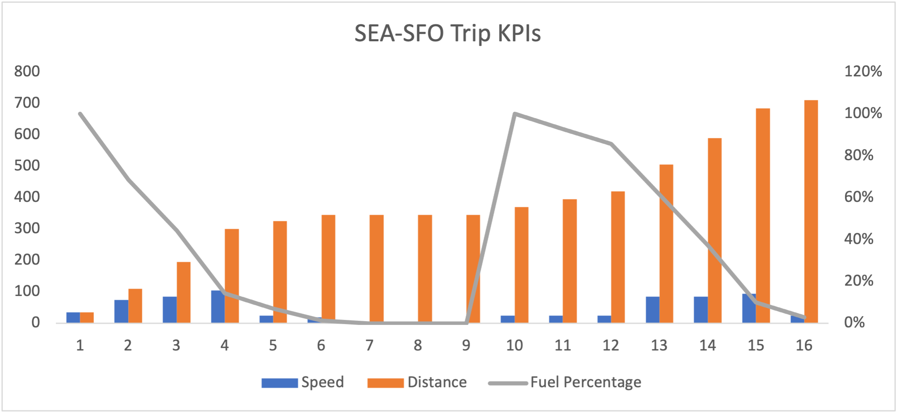
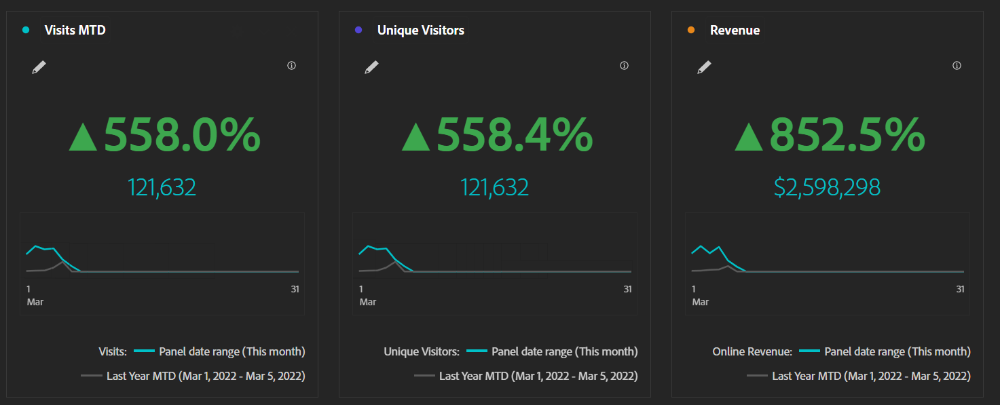
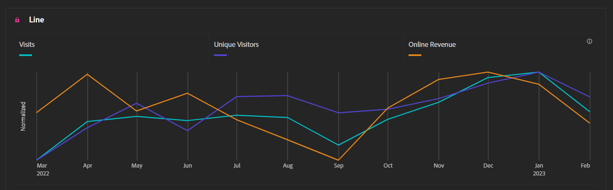
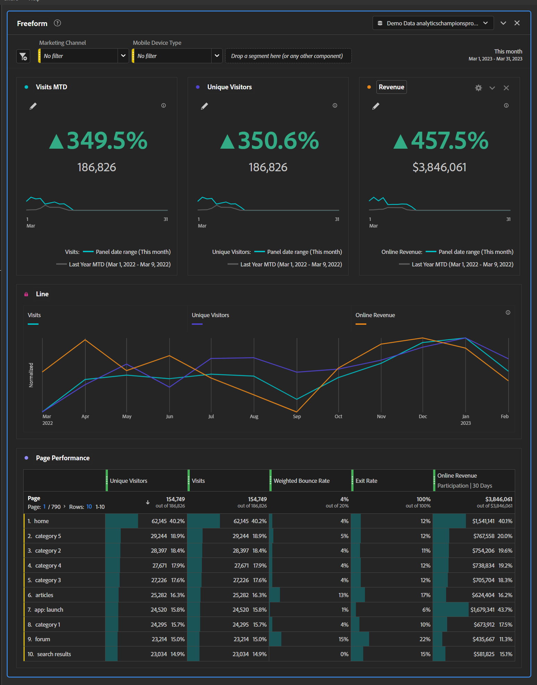

# Exceller grâce aux tableaux de bord exécutifs synthétiques

_Les cadres, qui manquent souvent d’informations pertinentes et opportunes sur leurs sites et applications, doivent composer avec des graphiques Excel mensuels ou des données granulaires confuses. La solution : les tableaux de bord exécutifs synthétiques._

Imaginez-vous en train de conduire de Seattle à San Francisco. Rien de bien compliqué... Prenez l’I-5 South pendant 12 à 16 heures et vous y êtes. C’est simple, n’est-ce pas ? Maintenant, je veux que vous imaginiez que j&#39;ai mis un morceau de carton sur votre tableau de bord, et je vous le dis à la fin
au cours de votre voyage, vous recevrez un tableau de bord qui vous indiquera votre vitesse, votre niveau de carburant et la distance parcourue :

Si vous examinez le graphique, vous pouvez remarquer les points suivants :

1. Votre vitesse a énormément varié, bien au-dessus de la limite légale à certains moments. Vous rouliez très lentement à certains endroits, notamment à cause du trafic à Portland.

1. La distance parcourue est statique pendant les heures 6 à 9

1. En fait, vous étiez en panne d’essence et avez dû attendre la dépanneuse, pour vous retrouver dans les bouchons de Portland et faire le plein

Un tel voyage serait évidemment malheureux, imprévisible et dangereux. Et ce n’est pas une bonne façon de conduire. Vous avez besoin d’informations continues sur la vitesse, la distance parcourue et le niveau de carburant pour effectuer des ajustements constants dans votre façon de conduire. Il ne fait aucun doute qu’une personne sensée arracherait le carton du tableau de bord pour y jeter régulièrement un œil. Cela permettrait de gagner des heures sur le trajet, éliminerait presque le risque de manquer d’essence et permettrait de rouler à la bonne vitesse pour éviter les contraventions.

Alors pourquoi tant de cadres acceptent-ils une situation similaire pour gérer leurs sites et leurs applications ?

De nombreux cadres n’ont pas accès à l’information pertinente et continue qui leur permettrait d’agir en temps voulu. Au lieu de cela, ils reçoivent une présentation mensuelle contenant des statistiques exportées d’Adobe Analytics vers Excel, représentées sous forme de graphiques et illustrées dans un PowerPoint. Si un point d’inflexion se produit au début du mois, ils ne le sauront pas avant le début du mois suivant, bien après avoir pu poser des questions ou prendre des mesures. Les alertes personnalisées sont également une excellente option, mais nous savons toutes et tous à quoi ressemble la boîte de réception d’une personne cadre.

Les cadres doivent disposer de suffisamment de données pour savoir quand leur attention est nécessaire immédiatement, sans pour autant engendrer de la frustration. Si vous recevez un message d’un ou d’une responsable produit ou d’un ou d’une responsable marketing indiquant qu’une personne cadre souhaite être informée d’une anomalie, vous touchez au but.

C’est là que le tableau de bord exécutif synthétique entre en jeu, en guise de « juste milieu ». Nous savons que les cartes de performance mobiles sont idéales pour les cadres en déplacement devant effectuer des contrôles, mais les tableaux de bord exécutifs synthétiques leur faciliteront le travail lorsqu’ils sont au bureau. Les cartes de performance mobiles peuvent les alerter sur un problème, alors que les tableaux de bord exécutifs synthétiques leur permettront de recueillir suffisamment d’informations pour poser les bonnes questions aux bonnes personnes.

La plupart des cadres ont environ trois KPI qui les préoccupent. Pour le commerce de détail, il peut s’agir des commandes, du chiffre d’affaires et de la valeur de commande moyenne. Pour le B2B, les leads, la qualité des leads et le taux de conversion sont les maîtres mots. Pour les services, il peut s’agir des visites, des rendez-vous et des personnes qui reviennent. Quelles que soient les trois KPI, indiquez-les en gras et en gros caractères, avec la variation annuelle et un graphique. La visualisation du résumé des mesures clés facilite les opérations suivantes :

Ajoutez des données historiques pour ces trois mêmes mesures afin d’afficher facilement les tendances à long terme :

Ajoutez quelques listes déroulantes pour tout ce qui est important pour votre organisation. Je trouve que le type d’appareil et le canal marketing sont généralement de bonnes options :

Ces deux options sont globalement assez importantes, mais comme toujours, assurez-vous que ce que vous choisissez est pertinent pour votre site ou votre application.

Enfin, en bas, ajoutez des détails. Je trouve que les performances des pages sont souvent populaires auprès des cadres, mais elles ne doivent pas apparaître à moins de faire défiler la page. Ils peuvent les rechercher, le cas échéant. Sinon, ils disposent déjà des données dont ils besoin pour poser immédiatement les bonnes questions :

Avec ce produit final en main, il vous suffit d’effectuer les opérations suivantes :

- Apprendre à vos cadres comment le lire

- Apprendre à vos cadres comment utiliser les filtres

- Apprendre à vos cadres comment effectuer une analyse en profondeur

- Vous faire du café et vous préparer, parce qu’une fois les données acquises, les cadres viendront vous poser un grand nombre de questions

En conclusion, les tableaux de bord exécutifs synthétiques permettent de disposer d’informations pertinentes et continues pour la prise de décisions en temps opportun. Les présentations mensuelles avec les graphiques Excel sont insuffisantes et l’abondance de données granulaires peut submerger les cadres. Pour bien communiquer, concentrez-vous sur les trois KPI les plus importants et fournissez des données historiques et des listes déroulantes pour les facteurs pertinents. Par formation
Les dirigeants savent comment utiliser le tableau de bord. Ils peuvent prendre des décisions éclairées et poser des questions. Les tableaux de bord exécutifs synthétiques peuvent améliorer les performances des sites et des applications, ce qui vous permettra d’exceller.

## Auteur

Ce document a été rédigé par :

**Gitai Ben-Ammi**, consultant principal chez Concentrix Catalyst

Adobe Analytics Champion
