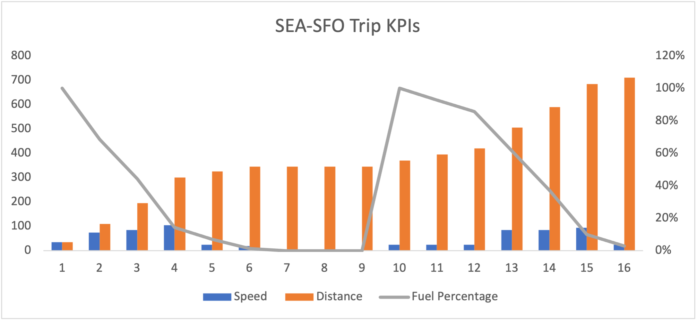
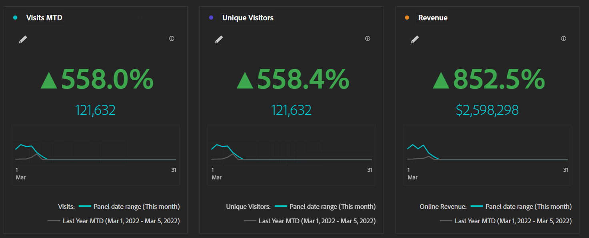
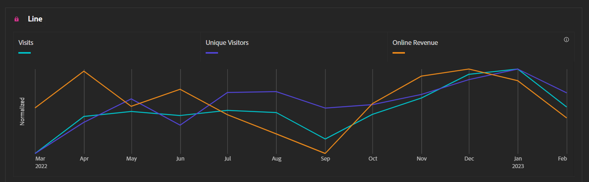
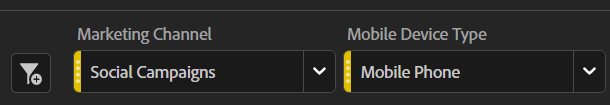
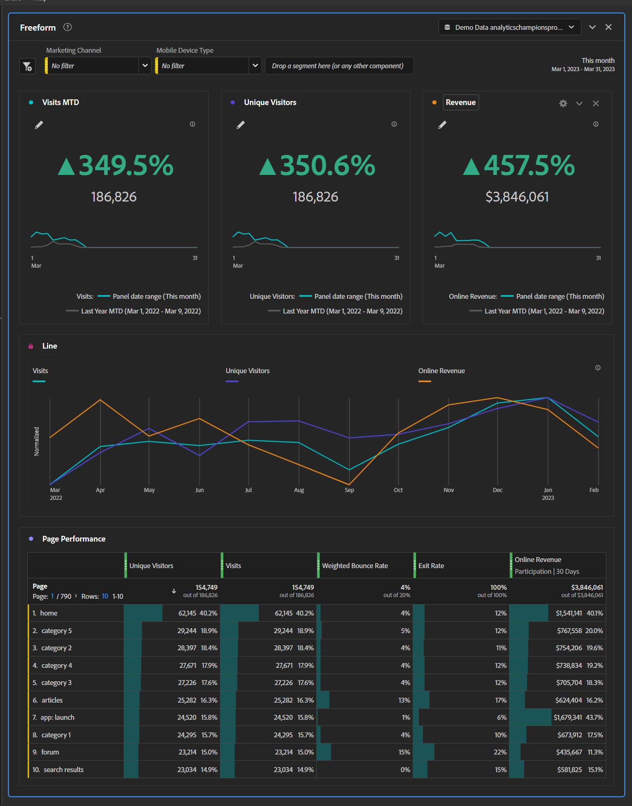

# Stimuler la réussite grâce aux tableaux de bord de synthèse pour les dirigeants

_Les cadres, qui manquent souvent d’informations pertinentes et opportunes sur leurs sites et applications, doivent composer avec des graphiques Excel mensuels ou des données granulaires confuses. La solution : les tableaux de bord exécutifs synthétiques._

Imaginez-vous en train de conduire de Seattle à San Francisco. Rien de bien compliqué... Prenez l’I-5 South pendant 12 à 16 heures et vous y êtes. C’est simple, n’est-ce pas ? Maintenant, je veux que vous imaginiez que j&#39;ai mis un morceau de carton sur votre tableau de bord, et je vous le dis à la fin
au cours de votre voyage, vous recevrez un tableau de bord qui vous indiquera votre vitesse, votre niveau de carburant et la distance parcourue :

Si vous examinez le graphique, vous pouvez remarquer les points suivants :

1. Votre vitesse a énormément varié, bien au-dessus de la limite légale à certains moments. Vous rouliez très lentement à certains endroits, notamment à cause du trafic à Portland.

1. La distance parcourue est statique pendant les heures 6 à 9

1. En fait, vous étiez en panne d’essence et avez dû attendre la dépanneuse, pour vous retrouver dans les bouchons de Portland et faire le plein

Un tel voyage serait évidemment malheureux, imprévisible et dangereux. Et ce n’est pas une bonne façon de conduire. Vous avez besoin d’informations continues sur la vitesse, la distance parcourue et le niveau de carburant pour effectuer des ajustements constants dans votre façon de conduire. Il ne fait aucun doute qu’une personne sensée arracherait le carton du tableau de bord pour y jeter régulièrement un œil. Cela permettrait de gagner des heures sur le trajet, éliminerait presque le risque de manquer d’essence et permettrait de rouler à la bonne vitesse pour éviter les contraventions.

Alors pourquoi tant de cadres acceptent-ils une situation similaire pour gérer leurs sites et leurs applications ?

De nombreux dirigeants n’ont pas accès en continu aux informations pertinentes dont ils ont besoin pour agir au moment opportun. Au lieu de cela, ils reçoivent une présentation mensuelle contenant des statistiques exportées d’Adobe Analytics vers Excel, représentées sous forme de graphiques et illustrées dans un PowerPoint. Si un point d’inflexion survient au début du mois, ils n’en auront connaissance qu’au début du mois suivant, bien trop tard pour poser des questions ou prendre des mesures. Les alertes personnalisées constituent également une excellente option, mais nous savons tous à quoi ressemble la boîte de réception d’un dirigeant.

Les cadres doivent disposer de suffisamment de données pour savoir quand leur attention est nécessaire immédiatement, sans pour autant engendrer de la frustration. Si vous recevez un message d’un responsable produit ou d’un responsable marketing vous indiquant qu’un dirigeant souhaite en savoir plus sur une anomalie, vous êtes dans le cas de figure idéal.

C’est là que le tableau de bord exécutif synthétique entre en jeu, en guise de « juste milieu ». Nous savons que la carte de performance mobile est idéale pour permettre à un dirigeant en déplacement de consulter rapidement les principaux indicateurs, mais un tableau de bord de synthèse pour les dirigeants peut lui permettre d’approfondir facilement l’analyse lorsqu’il est à son bureau. Les cartes de performance mobiles peuvent les alerter d’un problème, mais le tableau de bord de synthèse pour les dirigeants leur permettra ensuite de recueillir suffisamment d’informations pour poser les bonnes questions aux bonnes personnes.

La plupart des cadres ont environ trois KPI qui les préoccupent. Dans le secteur de la vente au détail, il peut s’agir des commandes, du chiffre d’affaires et de la valeur de commande moyenne (AOV). Pour le B2B, il peut s’agir des leads, de la qualité des leads et du taux de conversion. Pour les services, il peut s’agir des visites, des rendez-vous et des personnes qui reviennent. Quels que soient ces trois indicateurs, indiquez-les en gras et en gros caractères, avec l’évolution annuelle et un graphique. La visualisation du résumé des mesures clés facilite les opérations suivantes :

Ajoutez des données historiques pour ces trois mêmes mesures afin d’afficher facilement les tendances à long terme :

Ajoutez quelques listes déroulantes pour tout ce qui est important pour votre organisation. Je trouve que le type d’appareil et le canal marketing sont généralement de bonnes options :

Ces deux options sont globalement assez importantes, mais comme toujours, assurez-vous que ce que vous choisissez est pertinent pour votre site ou votre application.

Enfin, en bas, ajoutez des détails. Je trouve que les performances des pages sont souvent populaires auprès des cadres, mais elles ne doivent pas apparaître à moins de faire défiler la page. Ils peuvent approfondir l’analyse s’ils le souhaitent. Sinon, ils disposent déjà des données dont ils ont besoin pour poser immédiatement les bonnes questions :

Avec ce produit final en main, il vous suffit d’effectuer les opérations suivantes :

- Apprendre à vos cadres comment le lire

- Apprendre à vos cadres comment utiliser les filtres

- Apprenez-leur à analyser en profondeur les données.

- Vous faire du café et vous préparer, parce qu’une fois les données acquises, les cadres viendront vous poser un grand nombre de questions

En conclusion, les tableaux de bord de synthèse pour les dirigeants fournissent en continu des informations pertinentes permettant de prendre des décisions au moment opportun. Les présentations mensuelles avec les graphiques Excel sont insuffisantes et l’abondance de données granulaires peut submerger les cadres. Pour bien communiquer, concentrez-vous sur les trois KPI les plus importants et fournissez des données historiques et des listes déroulantes pour les facteurs pertinents. Par formation
Les dirigeants savent comment utiliser le tableau de bord. Ils peuvent prendre des décisions éclairées et poser des questions. Les tableaux de bord exécutifs synthétiques peuvent améliorer les performances des sites et des applications, ce qui vous permettra d’exceller.

## Auteur

Ce document a été rédigé par :

**Gitai Ben-Ammi**, consultant principal chez Concentrix Catalyst

Adobe Analytics Champion
