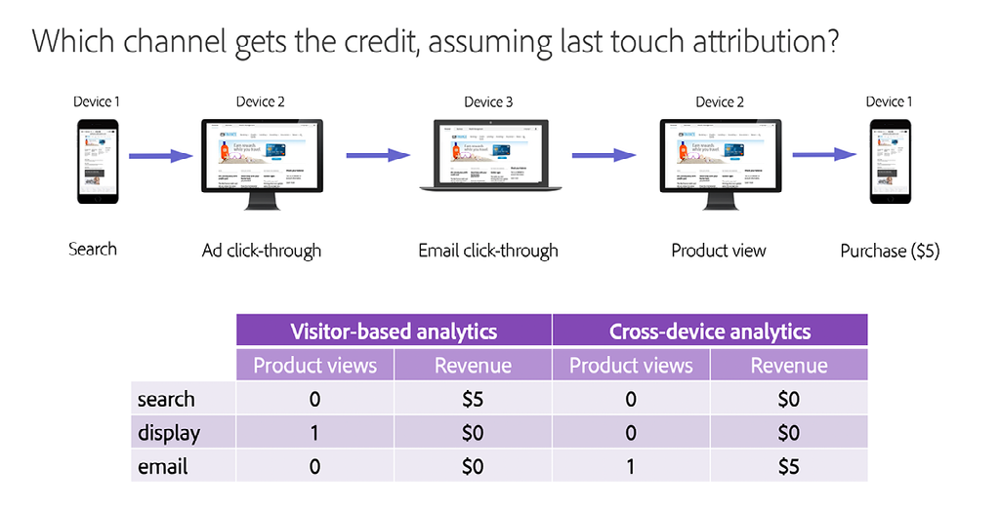

# Compréhension et utilisation de [!DNL Journey IQ] - Analytics sur l’ensemble des appareils

Lorsque les utilisateurs interagissent avec votre marque, ils le font de différentes manières et sur plusieurs appareils. Analytics sur l’ensemble des appareils s’intègre à [!DNL Adobe Experience Platform Identity Service] pour identifier la manière dont les appareils sont associés aux personnes. Il tire ensuite parti de ces renseignements pour créer une vue du comportement de l’utilisateur sur l’ensemble des appareils. Cela permet d’analyser les personnes, et non les appareils.

## Présentation d’Analytics sur l’ensemble des appareils

### Je ne suis pas mes appareils

Lorsque les utilisateurs interagissent avec votre marque, ils le font de nombreuses façons et sur plusieurs « surfaces » ou « appareils ». Ils peuvent utiliser un navigateur web sur un ordinateur ou un appareil mobile, ou une application mobile. Avec l’analytics numérique classique, développé dans la collecte de données basée sur des cookies, chacune de ces surfaces est représentée sous la forme d’un « visiteur » unique. Cela signifie que chacun de vos utilisateurs humains est représenté sous la forme de plusieurs visiteurs uniques.

Voici un exemple. Supposons qu’Isabelle interagisse avec votre marque de la manière suivante :

*Isabelle représente trois visiteurs*

En utilisant l’analytics de façon classique, le parcours d’Isabelle se divise en trois parties. Elle est représentée par trois visiteurs uniques, qui ont chacun utilisé un appareil différent pour effectuer des tâches isolées. Ce qu’il faut, c’est une vue unifiée sur plusieurs appareils des interactions d’Isabelle. [!DNL Journey IQ: Cross-Device Analytics] fournit cette vue.

*Isabelle représente une seule personne*

### Une vue sur plusieurs appareils fournit de meilleures analyses

Avoir une vue du comportement d’Isabelle centrée sur la personne et sur plusieurs appareils peut créer une différence significative dans votre analyse. Par exemple, l’approche traditionnelle basée sur les visiteurs ne donne pas une vue d’ensemble complète de l’efficacité des canaux marketing. Examinons à nouveau le parcours d’Isabelle en nous concentrant sur le canal qui reçoit du crédit pour sa consultation de produit et pour son achat. Nous utiliserons l’attribution [!UICONTROL Dernière touche] pour plus de simplicité, mais le même problème se produit avec n’importe quel modèle d’attribution lorsque vous divisez le comportement d’Isabelle en visiteurs distincts. L’utilisation de la vision traditionnelle du monde basée sur les visiteurs donne des résultats très différents, voire trompeurs :

*Utilisation classique d’Analytics vs Analytics sur l’ensemble des appareils*

Notez qu’avec la vue sur l’ensemble des appareils, le canal e-mail reçoit du crédit à la fois pour la consultation de produit et l’achat, ce qui représente plus précisément l’expérience réelle d’Isabelle.

Continuez à lire pour en savoir plus sur :

* Fonctionnement de la fonctionnalité [!DNL Cross-Device Analytics]
* Conditions préalables pour [!DNL Cross-Device Analytics]
* Interprétation des données sur l’ensemble des appareils
* Analyse des données multi-appareils dans Analysis Workspace

## Fonctionnement de la fonctionnalité [!DNL Cross-Device Analytics]

[!DNL Journey IQ: Cross-Device Analytics (CDA)] s’intègre à [!DNL Adobe Experience Platform Identity Service], en utilisant le [[!DNL Co-op Graph]](https://experienceleague.adobe.com/docs/device-co-op/using/home.html?lang=fr) ou le [!DNL Private Graph] pour identifier la manière dont les périphériques sont associés aux personnes. Il tire ensuite parti de ces renseignements pour créer une vue du comportement de l’utilisateur sur l’ensemble des appareils. Analytics sur l’ensemble des appareils dispose de fonctionnalités et d’outils inégalés pour aider votre entreprise à comprendre l’utilisation de plusieurs appareils et l’expérience client sur ces appareils dans leurs interactions avec votre marque. Il se trouve sous Analysis Workspace sous la forme d’une couche qui permet d’obtenir des informations détaillées sur l’analyse de l’audience basée sur la personne et l’attribution, la segmentation et l’analyse de parcours sur plusieurs appareils à l’aide d’outils puissants tels que [!UICONTROL Abandon], [!DNL Flow], [!DNL Cohort], [!DNL Segment IQ] et [!DNL Attribution IQ].

### [!DNL Cross-Device Virtual Report Suite]

Analytics sur l’ensemble des appareils se présente par l’intermédiaire d’un type spécial de [[!UICONTROL suite de rapports virtuelle]](https://experienceleague.adobe.com/docs/analytics/components/virtual-report-suites/vrs-about.html?lang=fr) d’analyses entre appareils. Cela vous permet de continuer à utiliser la suite de rapports d’origine basée sur les appareils lorsque vous introduisez l’analytics sur l’ensemble des appareils dans votre entreprise. La configuration d’une suite de rapports virtuelle pour Analytics sur l’ensemble des appareils est simple.

Dans la première étape du créateur de suites de rapports virtuelles, sélectionnez la [!UICONTROL suite de rapports] qui a été configurée par Adobe comme étant compatible avec Analytics sur l’ensemble des appareils :

*Choix d’une [!UICONTROL suite de rapports]* de base (source) compatible avec Analytics sur l’ensemble des appareils
![[!UICONTROL Suite de rapports virtuelle] Étape 1](assets/cda-vrs-step-one.png)

Ensuite, activez le [!UICONTROL Traitement de la période de rapport] et le [!UICONTROL groupement sur plusieurs appareils] :

*Activation du [!UICONTROL traitement de la période de rapport] et du [!UICONTROL groupement sur plusieurs appareils]*
![[!UICONTROL Suite de rapports virtuelle] Étape 2](assets/cda-vrs-step-two.png)

Terminez la configuration des suites de rapports virtuelles et enregistrez-la. La suite de rapports virtuelle d’Analytics sur l’ensemble des appareils s’affiche dans Analysis Workspace avec une icône spéciale en regard de celle-ci, comme illustré ci-dessous :

*Sélection de la suite de rapports virtuelle d’Analytics sur l’ensemble des appareils dans Analysis Workspace*
![[!UICONTROL Suite de rapports virtuelle] Étape 3](assets/cda-vrs-step-three.png)

>[!TIP]
>
>Vous pouvez créer autant de [!UICONTROL suites de rapports virtuelles] pour Analytics sur l’ensemble des appareils que vous le souhaitez en plus de la [!UICONTROL suite de rapports] de base compatible avec Analytics sur l’ensemble des appareils.

### Redéfinition de l’historique

Parfois, il faut un certain temps à vos utilisateurs pour se connecter et à [!DNL Co-op Graph] ou [!DNL Private Graph] pour les identifier et les associer à leurs appareils. Analytics sur l’ensemble des appareils utilise une période de recherche arrière de 30 jours, ce qui lui permet de redéfinir un visiteur précédemment non identifié en tant que personne jusqu’à 30 jours auparavant.

À quoi cela sert-il ? Rappelez-vous le parcours d’utilisateur d’Isabelle évoqué dans la discussion ci-dessus :

![[!DNL Cross-Device Analytics]Parcours](assets/cda-isabelle-journey-cross-device-analytics.png)

Il est possible qu’Isabelle ne se soit pas connectée avant d’effectuer l’achat, et que le [!DNL Co-op Graph] ou [!DNL Private Graph] n’aient pas associé les appareils d’Isabelle avant un certain temps après son achat. Mais la recherche en amont de 30 jours proposée par Analytics sur l’ensemble des appareils lui permet de redéfinir le comportement passé d’Isabelle au niveau de la personne, ce qui vous permet d’avoir une vue d’ensemble de son parcours dont vous avez besoin.

>[!NOTE]
>
>Puisque l’historique peut être redéfini, cela signifie que vos données peuvent changer au fil du temps dans une [!UICONTROL suite de rapports virtuelle] compatible avec Analytics sur l’ensemble des appareils. Gardez cela à l’esprit lorsque vous communiquez des informations à partir d’une analyse basée sur Analytics sur l’ensemble des appareils.

## Conditions préalables pour [!UICONTROL Analytics sur l’ensemble des appareils]

Analytics sur l’ensemble des appareils est inclus dans [[!DNL Analytics Ultimate]](https://helpx.adobe.com/fr/legal/product-descriptions/adobe-analytics.html). Depuis septembre 2019, les clients [!DNL Analytics Ultimate] qui remplissent les conditions préalables répertoriées ci-dessous peuvent utiliser Analytics sur l’ensemble des appareils. Les conditions préalables pour Analytics sur l’ensemble des appareils sont les suivantes :

* Votre société doit être membre d’[!DNL Adobe Experience Platform Identity Service] [[!DNL Co-op Graph]](https://experienceleague.adobe.com/docs/device-co-op/using/home.html?lang=fr), ou utilisez un [!DNL Adobe Experience Platform Identity Service Private Graph].
* Vous devez implémenter tous les éléments requis pour [!DNL Co-op Graph] ou [!DNL Private Graph], y compris [Experience Cloud ID (ECID)](https://experienceleague.adobe.com/docs/id-service/using/home.html?lang=fr) ainsi que la synchronisation des identifiants avec le graphique. Veuillez noter qu’en plus des exigences techniques, le [!DNL Co-op Graph] a d’autres exigences légales et contractuelles.
* Il n’est actuellement pas possible d’utiliser deux organisations IMS avec un seul [!DNL Private Graph]. Vous devez donc effectuer une normalisation sur une seule organisation IMS. Dans certains cas, il est possible pour un client avec plusieurs organisations IMS d’utiliser le [!DNL Co-op Graph] conjointement avec Analytics sur l’ensemble des appareils.
* Le [!DNL Co-op graph] et le [!DNL Private Graph], ainsi que certains composants d’Analytics sur l’ensemble des appareils, sont hébergés dans [!DNL Microsoft Azure]. Cela signifie que les données [!DNL Analytics] sont copiées entre le centre de traitement des données d’Adobe et la présence d’Adobe dans [!DNL Microsoft Azure]. Certaines données [!DNL Analytics] seront stockées dans [!DNL Azure]. Votre entreprise doit souscrire à cet arrangement.
* Analytics sur l’ensemble des appareils nécessite une [!UICONTROL suite de rapports] « sur l’ensemble des appareils ». En d’autres termes, la [!UICONTROL suite de rapports] que vous utilisez pour Analytics sur l’ensemble des appareils doit inclure des données provenant de plusieurs types d’appareils ou « surfaces » différents, tels que le web pour ordinateur de bureau, le web mobile et l’application mobile. Depuis septembre 2019, le volume des appels au serveur pour cette [!UICONTROL suite de rapports] doit être de 100 millions d’appels au serveur par jour ou moins. (Les limites du volume des appels au serveur augmenteront au cours des prochains mois.)
* Depuis septembre 2019, le [!DNL Co-op Graph] et le [!DNL Private Graph] ne sont disponibles qu’en Amérique du Nord. Le planning relatif à la présence des graphiques dans les zones EMEA et APAC sera annoncé ultérieurement. Si vous vous trouvez dans ces régions, nous vous encourageons à examiner ces conditions préalables dès à présent afin d’être prêt lorsque le graphique sera disponible.

## Interprétation des données sur l’ensemble des appareils

### Personnes non-visiteurs

Dans la [!UICONTROL suite de rapports virtuelle] d’Analytics sur l’ensemble des appareils, quelques modifications s’affichent. Par exemple, la mesure [!UICONTROL Visiteurs uniques] est remplacée par deux nouvelles mesures : [!UICONTROL Personnes] et [!UICONTROL Appareils uniques]. Ces nouvelles mesures vous donnent un meilleur aperçu de la taille de l’audience.

*Personnes et appareils uniques*
![Analytics sur l’ensemble des appareils [!UICONTROL Mesure Personnes]](assets/cda-people-metric.png)

Dans le [[!UICONTROL Créateur de segments]](https://experienceleague.adobe.com/docs/analytics/components/segmentation/segmentation-workflow/seg-build.html?lang=fr), le conteneur de segments [!UICONTROL Visiteurs] a été remplacé par un conteneur de segments [!UICONTROL Personnes]. À l’aide d’une suite de rapports virtuelle Analytics sur l’ensemble des appareils, vous pouvez créer des segments entre appareils tels que :

* Les personnes qui utilisent plus d’un appareil.
* Les personnes qui commencent leur parcours sur un appareil mobile et achètent ensuite sur un ordinateur.
* Les visites au cours desquelles des personnes utilisent plusieurs appareils pour accomplir une tâche.

*Segments au niveau de la personne*
![[!DNL Segment Builder] [!UICONTROL Personne] Conteneur](assets/cda-segment-builder-person-container.png)

### Persistance des dimensions

Dans une suite de rapports virtuelle d’analyses entre appareils, des dimensions telles que [!DNL eVars] persistent désormais automatiquement sur tous les appareils. Par exemple, une [!DNL eVar] qui est configurée comme suit :

* Attribution : le plus récent (dernier)
* Expire après : achat

persistera désormais automatiquement d’un appareil à un autre jusqu’à ce que l’événement d’achat soit déclenché.

## Analyse des données multi-appareils dans Analysis Workspace

### Analyse de l’audience basée sur les personnes

Vous êtes-vous déjà demandé combien de personnes interagissent avec votre marque ? Avez-vous voulu comprendre combien et quel type d’appareils elles utilisent ? Comment leurs utilisations se superposent-elles ? À l’aide d’une suite de rapports virtuelle d’analyses entre appareils, vous pouvez créer des [diagrammes de Venn](https://experienceleague.adobe.com/docs/analytics/analyze/analysis-workspace/visualizations/venn.html?lang=fr) et des [histogrammes](https://experienceleague.adobe.com/docs/analytics/analyze/analysis-workspace/visualizations/histogram.html?lang=fr) d’appareils par personne.

*Analyse de l’audience basée sur les personnes*

### [!DNL Flow] entre appareils

Avec les analyses entre appareils et Analysis Workspace, vous pouvez visualiser la manière dont les utilisateurs passent d’un appareil à un autre au fil du temps dans [[!DNL Flow visualization]](https://experienceleague.adobe.com/docs/analytics/analyze/analysis-workspace/visualizations/flow/flow.html?lang=fr). Vous pouvez voir où ils abandonnent dans leur parcours, et où ils continuent.

*[!DNL Flow]avec CDA*
![[!DNL Flow Visualization]](assets/cda-flow-viz.png)

### [!DNL Fallout] entre appareils

Vous utilisez probablement plusieurs [[!DNL Fallout visualizations]](https://experienceleague.adobe.com/docs/analytics/analyze/analysis-workspace/visualizations/fallout/fallout-flow.html?lang=fr) pour analyser la façon dont les utilisateurs réussissent à passer par une série donnée d’étapes avant d’atteindre le succès. Saviez-vous que votre vue de ces [!DNL Fallout visualizations] est limitée lors de l’utilisation d’analyses traditionnelles basées sur les appareils ? Pour réussir un « abandon », l’étape suivante doit se produire dans le même navigateur ou la même application que l’étape précédente. Dans les analyses basées sur un appareil, vous ne connaissez pas les personnes qui ont réussi l’étape suivante sur un autre appareil.

Ne vous inquiétez pas, Analytics sur l’ensemble des appareils a tout prévu. Analytics sur l’ensemble des appareils crée la vue sur plusieurs appareils qui rend [!DNL Fallout visualizations] beaucoup, beaucoup plus utile. Après tout, ce qui compte vraiment, c’est de savoir si la personne a finalement réussi quelque part dans sa tâche.

*[!DNL Fallout]avec CDA*
![[!DNL Fallout Visualization]](assets/cda-fallout-viz.png)

### [!DNL Cross-Device Attribution IQ]

Comme Analytics sur l’ensemble des appareils crée une couche de données multi-appareils sous Analysis Workspace, toutes vos analyses seront adaptées aux différents appareils. Un exemple parlant est celui d’[[!DNL Attribution IQ]](https://experienceleague.adobe.com/docs/analytics/analyze/analysis-workspace/panels/attribution/attribution.html?lang=fr). [!DNL Attribution IQ] dans Analysis Workspace, vous permet de comparer plusieurs modèles d’attribution côte à côte. Grâce à cette fonctionnalité, vous pouvez désormais comparer la contribution de différents appareils à la réussite.

Supposons, par exemple, que vous souhaitiez comprendre à quelle fréquence un téléphone mobile est le premier appareil utilisé dans une interaction qui, finalement, mène au succès. Ceci représente le « taux d’acquisition » du téléphone mobile. CDA + [!DNL Attribution IQ] vous permet d’effectuer cette analyse :

*[!DNL Attribution IQ]avec CDA*
![[!DNL Attribution IQ]](assets/cda-attribution-iq.png)

Pour plus d’informations, consultez la [[!DNL Cross-Device Analytics] documentation d’aide](https://experienceleague.adobe.com/docs/analytics/components/cda/cda-home.html?lang=fr).
