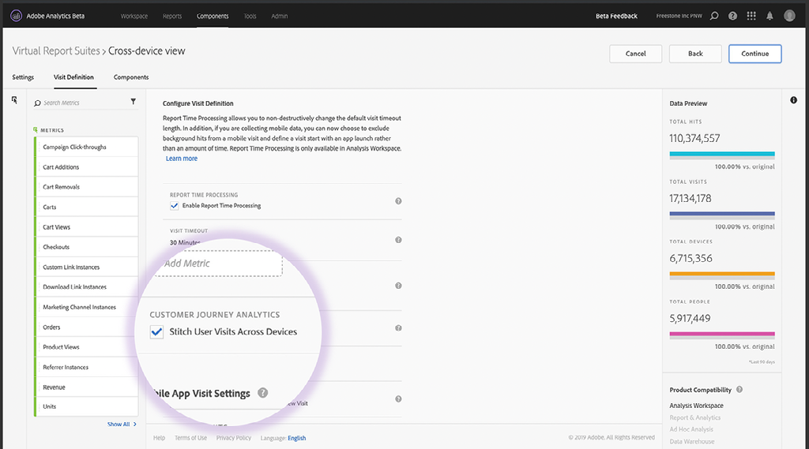

# Compréhension et utilisation [!DNL Journey IQ] - Analyses sur plusieurs périphériques

Lorsque les utilisateurs interagissent avec votre marque, ils le font de nombreuses manières et sur plusieurs périphériques. Analytics sur plusieurs périphériques s’intègre à la fonction [!DNL Adobe Experience Platform Identity Service] d’identification de la mise en correspondance des périphériques avec les utilisateurs. Il utilise ensuite cette intelligence pour créer une vue inter-périphériques du comportement des utilisateurs. Cela se traduit par la possibilité de faire analyse sur les gens, pas sur les appareils.

## Présentation des analyses sur plusieurs périphériques

### Je ne suis pas mes appareils

Lorsque les utilisateurs interagissent avec votre marque, ils le font de nombreuses manières et sur plusieurs &quot;surfaces&quot; ou &quot;périphériques&quot;. Ils peuvent utiliser un navigateur Web sur un ordinateur ou un périphérique mobile, ou ils peuvent utiliser une application mobile. Dans les analyses numériques traditionnelles, qui ont grandi dans la collecte de données basée sur des cookies, chacune de ces surfaces est représentée par un &quot;visiteur&quot; unique. Cela signifie que chacun de vos utilisateurs humains est représenté sous la forme de plusieurs visiteurs uniques.

Voici un exemple. Supposons qu’Isabelle ait interagi avec votre marque de la manière suivante :

*Isabelle est trois trajets visiteur*

En utilisant les analyses traditionnelles, le parcours d&#39;Isabelle se divise en trois parties. Elle est représentée en tant que trois visiteurs uniques, dont chacun a utilisé un dispositif différent pour effectuer des tâches isolées. Il faut une vue unifiée et transversal des interactions d&#39;Isabelle. [!DNL Journey IQ: Cross-Device Analytics] fournit cette vue.

*Isabelle est l’une des personnes*

### Une Vue Sur Plusieurs Périphériques Offre De Meilleures Analyses

Avoir une vue du comportement d&#39;Isabelle centrée sur la personne et sur plusieurs périphériques peut faire une différence significative dans votre analyse. Par exemple, l’approche traditionnelle fondée sur le visiteur ne vous donne pas une vue complète de l’efficacité du canal marketing. Examinons une fois de plus le voyage d&#39;Isabelle, en se concentrant sur le canal qui reçoit du crédit pour sa vue de produits et pour son achat. Nous utiliserons l&#39;attribution [!UICONTROL Dernière touche] pour simplifier, mais le même problème survient en utilisant n&#39;importe quel modèle d&#39;attribution quand vous divisez le comportement d&#39;Isabelle en visiteurs distincts. L&#39;utilisation de la vue traditionnelle du monde basée sur les visiteurs donne des résultats très différents, voire trompeurs :

*Analyses traditionnelles ou attribution de* canal entre plusieurs dispositifs Analytics

Notez qu&#39;avec la vue sur plusieurs périphériques, le canal électronique reçoit du crédit à la fois pour la vue du produit et pour l&#39;achat, ce qui représente plus précisément l&#39;expérience réelle d&#39;Isabelle.

Continuez à lire pour en savoir plus sur :

* How [!DNL Cross-Device Analytics] Works
* Conditions préalables pour [!DNL Cross-Device Analytics]
* Interprétation des données sur plusieurs périphériques
* Analyse des données sur plusieurs périphériques en Analysis Workspace

## How [!DNL Cross-Device Analytics] Works

[!DNL Journey IQ: Cross-Device Analytics (CDA)] s&#39;intègre à la [!DNL Adobe Experience Platform Identity Service], en utilisant soit le [[ ! DNL Co-op Graph]](https://docs.adobe.com/content/help/fr-FR/device-co-op/using/home.html) , soit [!DNL Private Graph] pour identifier comment les périphériques correspondent aux personnes. Il utilise ensuite cette intelligence pour créer une vue inter-périphériques du comportement des utilisateurs. CDA comprend des fonctionnalités et des outils inégalés pour aider votre entreprise à comprendre l&#39;utilisation de plusieurs périphériques et l&#39;expérience client de ces périphériques dans leurs interactions avec votre marque. Il est situé sous Analysis Workspace pour fournir une vue d&#39;ensemble approfondie de l&#39;analyse d&#39;audience basée sur la personne et de l&#39;attribution, de la segmentation et de l&#39;analyse de voyage inter-dispositifs en utilisant des outils puissants tels que [!UICONTROL Abandon], [!DNL Flow], [!DNL Cohort][!DNL Segment IQ] et [!DNL Attribution IQ].

### La [!DNL Cross-Device Virtual Report Suite]

L’ADC est présenté au moyen d’une suite [[!UICONTROL de rapports]](https://docs.adobe.com/content/help/fr-FR/analytics/components/virtual-report-suites/vrs-about.html)virtuelle sur plusieurs périphériques. Cela vous permet de continuer à utiliser la suite de rapports d’origine basée sur les périphériques lorsque vous introduisez les analyses inter-périphériques dans votre entreprise. La mise en place d&#39;une SRC CDA est facile.

Dans l’étape 1 du créateur de suites de rapports virtuelles, sélectionnez la suite [!UICONTROL de] rapports qui a été configurée par Adobe comme étant activée pour CDA :

*Choisir une base de[!UICONTROL rapports (source) compatible CDA Suite]*

Ensuite, activez le traitement [!UICONTROL du temps des] rapports et activez l’assemblage sur plusieurs périphériques :

*Activation du traitementdes rapports et de l’assemblage*

Terminez la configuration de la suite de rapports virtuelle et enregistrez-la. La suite de rapports virtuelle CDA s’affiche en Analysis Workspace avec une icône spéciale en regard de celle-ci, comme illustré ci-dessous :

*Sélectionnez la suite de rapports virtuelle CDA dans Analysis Workspace*![[!UICONTROL Virtual Report Suite] - Etape 3](assets/cda-vrs-step-three.png)

>[!TIP]
>
>Vous pouvez créer autant de Report Suites  virtuelles CDA que vous le souhaitez en plus de la Report Suite de base activée CDA.

### Redémarrage de l&#39;historique

Il peut parfois s’écouler un certain temps avant que vos utilisateurs se connectent et se connectent à la [!DNL Co-op Graph] ou [!DNL Private Graph] à l’identifier et mappent leurs appareils. L&#39;ADC utilise une fenêtre de recherche en amont de 30 jours, ce qui lui permet de retraiter un visiteur précédemment non identifié comme une personne jusqu&#39;à 30 jours dans le passé.

Comment cela aide-t-il ? Rappelez-vous le parcours de l&#39;utilisateur Isabelle de la discussion ci-dessus :

![[!DNL Cross-Device Analytics] Voyage](assets/cda-isabelle-journey-cross-device-analytics.png)

Il est possible qu&#39;Isabelle n&#39;ait pas ouvert de session avant de faire l&#39;achat, et que la [!DNL Co-op Graph] ou [!DNL Private Graph] n&#39;ait pas cartographié les appareils d&#39;Isabelle avant un certain temps après son achat. Mais le retour en arrière de 30 jours de l&#39;Académie canadienne de la Défense permet à l&#39;Académie de reproduire le comportement passé d&#39;Isabelle au niveau de la personne, en vous offrant la vue transversal de son voyage dont vous avez besoin.

>[!NOTE]
>
>Comme l’historique peut être redémarré, cela signifie que vos données peuvent changer au fil du temps dans une suite [!UICONTROL de rapports]virtuelle CDA. Gardez cela à l’esprit lorsque vous communiquez des renseignements provenant d’une analyse fondée sur l’ADC.

## Conditions Préalables Pour Les Analyses [!UICONTROL Sur Plusieurs Périphériques]

CDA est inclus avec [[ ! DNL Analytics Ultimate]](https://helpx.adobe.com/legal/product-descriptions/adobe-analytics.html). À compter de septembre 2019, [!DNL Analytics Ultimate] les clients qui remplissent les conditions requises énumérées ci-dessous peuvent utiliser l’ADC. Les conditions préalables à l&#39;ADC sont les suivantes :

* Votre société doit être membre du [!DNL Adobe Experience Platform Identity Service] [ !DNL Co-op Graph] [ou utiliser un](https://docs.adobe.com/content/help/fr-FR/device-co-op/using/home.html)[!DNL Adobe Experience Platform Identity Service Private Graph]graphique.
* Vous devez mettre en oeuvre tout ce qui est nécessaire pour [!DNL Co-op Graph] ou [!DNL Private Graph] y compris l’identifiant [Experience Cloud (ECID)](https://docs.adobe.com/content/help/fr-FR/id-service/using/home.html) et la synchronisation des identifiants avec le graphique. Il convient de noter qu&#39;en plus des exigences techniques, la [!DNL Co-op Graph] Commission a d&#39;autres exigences juridiques et contractuelles.
* Il n&#39;est actuellement pas possible d&#39;utiliser deux organisations IMS avec un seul [!DNL Private Graph], vous devez donc standardiser sur une seule organisation IMS. Dans certains cas, il est possible pour un client disposant de plusieurs services IMS d&#39;utiliser le logiciel [!DNL Co-op Graph] conjointement avec CDA.
* Les [!DNL Co-op graph] et [!DNL Private Graph], ainsi que certains composants de l&#39;ADC, sont hébergés dans [!DNL Microsoft Azure]. Cela signifie que [!DNL Analytics] les données sont copiées entre le centre de traitement des données de l&#39;Adobe et la présence de l&#39;Adobe dans [!DNL Microsoft Azure]. Certaines [!DNL Analytics] données seront stockées dans [!DNL Azure]. Votre société doit accepter cet arrangement.
* L’ADC nécessite une suite [!UICONTROL de]rapports &quot;inter-périphériques&quot;. En d’autres termes, la suite [!UICONTROL de] rapports que vous utilisez pour l’ADC doit inclure des données provenant de plusieurs types d’appareils ou &quot;surfaces&quot; différents, tels que le web pour ordinateur de bureau, le web mobile et l’application mobile. À compter de septembre 2019, le volume des appels au serveur pour cette suite [!UICONTROL de] rapports doit être de 100 MM/jour ou moins. (Les limites de volume des appels du serveur augmenteront au cours des prochains mois.)
* Depuis septembre 2019, les [!DNL Co-op Graph] et [!DNL Private Graph] sont disponibles uniquement en Amérique du Nord. Le calendrier de la présence des graphiques dans la zone EMEA et l&#39;APAC sera annoncé à une date ultérieure. Si vous êtes dans ces régions, nous vous encourageons à début d&#39;examiner ces conditions préalables dès maintenant afin que vous soyez prêt à y aller lorsque le graphique sera disponible.

## Interprétation des données sur plusieurs périphériques

### Personnes non Visiteuses

Dans la suite [!UICONTROL de rapports]virtuelle CDA, vous verrez quelques modifications. Par exemple, la mesure Visiteurs  uniques est remplacée par deux nouvelles mesures : [!UICONTROL Personnes] et périphériques uniques. Ces nouvelles mesures vous permettent de mieux comprendre la taille des audiences.

*Mesure Personnes et périphériques*![uniques [!UICONTROL CDAPersonnes]](assets/cda-people-metric.png)

Dans le créateur [[!UICONTROL de]](https://docs.adobe.com/content/help/fr-FR/analytics/components/segmentation/segmentation-workflow/seg-build.html)segments, le conteneur de segments du [!UICONTROL Visiteur] a été remplacé par un conteneur de segments [!UICONTROL Personne] . A l’aide d’une suite de rapports virtuelle CDA, vous pouvez créer des segments interpériphériques tels que :

* Personnes qui utilisent plusieurs périphériques
* Personnes qui commencent leur voyage sur un périphérique mobile puis effectuent un achat ultérieur sur un périphérique de bureau
* Visites où des personnes utilisent plusieurs appareils pour accomplir une tâche

*Segments*![[!DNL Segment Builder] au niveau de la personne  Conteneur de la personne](assets/cda-segment-builder-person-container.png)

### Persistance de la Dimension

Dans une suite de rapports virtuelle CDA, les dimensions telles que [!DNL eVars] maintenant persistent automatiquement sur tous les périphériques. Par exemple, un [!DNL eVar] qui est configuré comme suit :

* Affectation : Le plus récent (Dernier)
* Expire après : Achat

persistera désormais automatiquement d’un périphérique à l’autre jusqu’à ce que le événement d’achat soit déclenché.

## Analyse des données sur plusieurs périphériques en Analysis Workspace

### Analyse d&#39;Audience basée sur la personne

Vous êtes-vous déjà demandé combien de personnes interagissent avec votre marque ? Avez-vous voulu comprendre combien et quel type d&#39;appareils ils utilisent ? Comment leur utilisation se recoupe-t-elle ? A l’aide d’une suite de rapports virtuelle CDA, vous pouvez créer des diagrammes [de](https://docs.adobe.com/content/help/fr-FR/analytics/analyze/analysis-workspace/visualizations/venn.html) Venn sur plusieurs périphériques et des [histogrammes](https://docs.adobe.com/content/help/fr-FR/analytics/analyze/analysis-workspace/visualizations/histogram.html)par personne pour les périphériques.

*Analyse*

### Multi-appareils [!DNL Flow]

Avec CDA et Analysis Workspace, vous pouvez visualiser comment les gens passent d’un appareil à l’autre au fil du temps dans la visualisation [[ ! DNL Flow]](https://docs.adobe.com/content/help/fr-FR/analytics/analyze/analysis-workspace/visualizations/flow/flow.html). Vous pouvez voir où ils abandonnent leur voyage, et où ils poursuivent.

*[!DNL Flow]avec CDA*
![[!DNL Flow Visualization]](assets/cda-flow-viz.png)

### Multi-appareils [!DNL Fallout]

Il est probable que vous utilisiez plusieurs visualisations [[ ! DNL Fallout]](https://docs.adobe.com/content/help/fr-FR/analytics/analyze/analysis-workspace/visualizations/fallout/fallout-flow.html) pour analyser comment les utilisateurs réussissent à passer par une série d’étapes donnée avant d’atteindre le succès. Saviez-vous que votre vue en la matière [!DNL Fallout visualizations] est limitée lors de l’utilisation d’analyses traditionnelles basées sur un périphérique ? Pour que les &quot;abandons&quot; réussissent, l’étape suivante doit se produire dans le même navigateur ou application que l’étape précédente. Dans les analyses basées sur un périphérique, vous n’êtes pas conscient des personnes qui effectuent l’étape suivante sur un autre périphérique.

Pas d&#39;inquiétude, l&#39;ADC vous a couvert. L&#39;ADC crée la vue inter-appareils qui rend [!DNL Fallout visualizations] beaucoup, beaucoup plus utile. Après tout, ce qui compte vraiment, c&#39;est si la personne a finalement réussi quelque part dans sa tâche.

*[!DNL Fallout]avec CDA*
![[!DNL Fallout Visualization]](assets/cda-fallout-viz.png)

### [!DNL Cross-Device Attribution IQ]

Etant donné que l’ADC crée une couche de données inter-périphériques sous Analysis Workspace, toute votre analyse sera parfumée dans une perspective inter-périphériques. Un exemple puissant est celui de [[ !DNL Attribution IQ]](https://docs.adobe.com/content/help/fr-FR/analytics/analyze/analysis-workspace/attribution/models.html). [!DNL Attribution IQ] en Analysis Workspace vous permet de comparer plusieurs modèles d’attribution côte à côte. Grâce à cette fonctionnalité, vous pouvez maintenant comparer comment différents périphériques contribuent à la réussite.

Supposons, par exemple, que vous souhaitiez comprendre à quelle fréquence un téléphone portable est le premier appareil utilisé dans une interaction qui conduit finalement à la réussite. Ceci représente le &quot;taux d&#39;acquisition&quot; du téléphone mobile. CDA + [!DNL Attribution IQ] vous permet de faire cette analyse :

*[!DNL Attribution IQ]avec CDA*
![[!DNL Attribution IQ]](assets/cda-attribution-iq.png)

For more information, see the [[!DNL Cross-Device Analytics] help documentation](https://docs.adobe.com/content/help/fr-FR/analytics/components/cda/cda-home.html).
