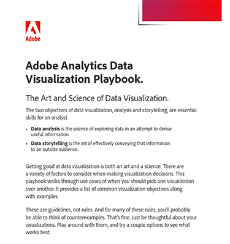

# Playbook de visualisation des données Adobe Analytics

La visualisation de données est à la fois un art et une science, qui nécessite une prise en compte attentive de divers facteurs. Pour vous aider à prendre certaines de ces décisions, nous avons élaboré le guide de visualisation des données .

[Télécharger](assets/adobe-analytics-data-visualization-playbook.pdf) le guide de visualisation Adobe Analytics

Que vous abordiez des questions commerciales courantes ou que vous plongiez dans des analyses complexes, ce playbook complet examine un éventail de cas d’utilisation pour démontrer quand et comment utiliser efficacement différentes visualisations.

## Auteur

Ce document a été créé par David Geist,
consultant en données et informations chez Adobe.
