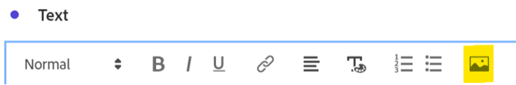

# Plus que des mots : utilisation de visualisations et de descriptions textuelles dans Analysis Workspace

En tant qu’utilisateur d’Adobe Analytics Analysis Workspace, il est naturel que vous vous concentriez souvent sur vos données et vos visualisations de données. N’importe qui peut saisir un résumé, n’est-ce pas ? Toutefois, ignorer certaines fonctionnalités d’Analysis Workspace telles que la visualisation de texte ou les descriptions de visualisation peut signifier manquer une opportunité précieuse d’associer vos informations à du texte, des images, des gifs et des liens de valeur. En donnant des références et plus de contexte pour informer vos utilisateurs sur la signification de vos données, vous pouvez les rendre plus efficaces et plus percutantes.

Tout d’abord, assurez-vous de savoir où trouver ces fonctionnalités :

- Pour ajouter ou modifier la description d’une visualisation, cliquez simplement avec le bouton droit de la souris sur la zone supérieure de l’élément et sélectionnez le lien « Modifier la description » :

  

- Pour ajouter un panneau Texte distinct, cliquez sur le menu Visualisations de la barre de navigation de gauche :

  

Ce guide illustre l’utilisation de l’une de ces deux méthodes, mais vous pouvez effectuer des ajouts similaires dans les descriptions et les visualisations de texte. Vous pouvez également ajuster la hauteur de police, l’alignement, la couleur et créer des listes à puces ou numérotées :

Allons-y ! Un lien hypertexte est très utile pour ajouter un élément de contexte à un projet Analysis Workspace. Il peut s’agir d’un lien vers l’URL de la page détaillée dans le rapport, de liens vers d’autres projets Analysis Workspace, de pages de contexte de rapport externe ou de toute autre élément utile pour vous aider à consulter votre rapport. Pour accéder à cette fonctionnalité, sélectionnez n’importe quelle partie de votre texte et cliquez sur l’icône « lien » :

Il en résulte que toute personne qui consulte le projet Analysis Workspace peut accéder en un seul clic à n’importe quelle page à laquelle elle a accès en ligne ou sur l’intranet de votre entreprise :

Désormais, si vous préférez importer le contenu directement dans votre rapport, vous pouvez utiliser un lien Image pour placer le contenu à côté de vos données :

Vous pouvez ajouter à votre rapport une image accessible sur n’importe quelle URL publique, à condition que l’URL soit au format *https* et qu’elle soit formatée en .png, .jpeg, .jpg ou .gif. Cela peut sembler restrictif, mais tous les outils en ligne utilisés pour partager des images ou des GIF tels que imgur ou GIPHY peuvent fournir une méthode rapide pour charger des fichiers accessibles par Workspace à l’aide d’un lien de partage.

Le résultat ? Vous pouvez afficher la page web à laquelle vos données font référence directement dans votre projet :

Vous pouvez également utiliser des GIF dans vos projets pour inclure des images mobiles telles qu’une présentation de site, un chemin idéal à travers votre site ou une tâche sur votre application, ou simplement montrer à votre équipe à quel point vos rapports sont devenus ***époustouflants*** :

## Auteur

Ce document a été rédigé par :

**Dan Cummings**, directeur principal de l&#39;analyse technique des produits chez McDonald&#39;s Corporation

Adobe Analytics Champion
