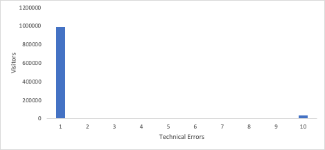

# Déverrouiller des informations avec des histogrammes : au-delà des moyennes dans Analytics

_Découvrez l’impact des histogrammes dans les analyses pour obtenir des informations au-delà des moyennes. Les histogrammes révèlent les modèles de données concernant le comportement des clients, l’engagement des visiteurs, les performances techniques et les erreurs de formulaire, ce qui permet d’obtenir des informations plus précises et de prendre des décisions éclairées dans Adobe Workspace._

On y va tout de suite. Vous devriez utiliser [histogrammes](https://experienceleague.adobe.com/docs/analytics/analyze/analysis-workspace/visualizations/histogram.html?lang=fr). Je vais vous expliquer pourquoi, mais je veux répondre à votre première question : qu&#39;est-ce qu&#39;un histogramme ? J&#39;ai compris. La plupart du temps, quand vous voyez un tas de barres qui montent, vous pourriez penser que c&#39;est un graphique à barres. Oui, les histogrammes se ressemblent, mais je vous assure qu&#39;ils sont différents. Un graphique à barres compare les éléments, tandis qu’un histogramme indique la fréquence à laquelle une variable s’est produite. Jette un œil. Voici un graphique à barres :

Nous avons six modèles, et nous pouvons comparer les revenus de chaque modèle. Nous constatons que le modèle de Johannesburg génère le plus de recettes, tandis que Berlin en génère le moins.

Maintenant, regardons un histogramme :

Au bas de l’axe des abscisses figure le nombre d’unités achetées par chaque client. La première barre représente la fréquence à laquelle un client a acheté une unité, la seconde indique le nombre de clients qui ont acheté deux unités, et ainsi de suite, jusqu’à concurrence de dix clients qui en achètent dix ou plus.

Alors, en quoi cela est-il utile ? Eh bien, la plupart des gens n&#39;achètent qu&#39;une seule unité. Il continue de diminuer jusqu&#39;à ce que nous en arrivions à cinq logements. Puis, il diminue de nouveau jusqu&#39;à ce que nous atteignions dix unités. Cela montre que les clients aiment vraiment acheter en multiples de cinq, et peut-être devrions-nous offrir un prix spécial ou un emballage pour en profiter. Mais il y a certainement beaucoup d&#39;autres utilisations.

## Comprendre l’engagement des visiteurs

Si votre site ou votre application repose sur un trafic répété, vous souhaitez savoir combien de visiteurs reviennent et à quelle fréquence. L’un des histogrammes les plus simples que vous pouvez utiliser consiste à déterminer le nombre de visiteurs qui reviennent plus d’une fois. En suivant cet histogramme au fil du temps, vous pouvez voir vos progrès, car j&#39;espère que les barres sur la droite seront plus hautes et celles sur la gauche seront plus courtes.

Peut-être que vous voulez garder les gens sur le site, en lisant des articles. Un histogramme indiquant le nombre de visiteurs qui lisent différents nombres d’articles vous donnerait une idée du niveau d’engagement d’insight. Pourquoi est-ce utile ? Supposons que la plupart des visiteurs lisent un article et partent, mais que certains visiteurs très engagés lisent trois articles et partent. C&#39;est une excellente information ! Vous savez maintenant que vous devez personnaliser la page du premier et du troisième articles lus dans le but d’inciter les visiteurs à lire un article supplémentaire.

## Comprendre le comportement des clients

Le propriétaire du produit pour les dossiers des patients d&#39;un système hospitalier m&#39;a demandé des données. Il y avait six régions parmi lesquelles choisir pour obtenir vos dossiers médicaux. Elle voulait savoir combien de personnes cliquaient sur plus d&#39;un. J’ai créé un histogramme qui montre combien de visiteurs cliquaient sur 1, 2, 3, 4, 5 ou 6 options. Cela peut sembler excessif, mais plus de la moitié des visiteurs cliquaient sur au moins deux options et 3,2 % des visiteurs cliquaient sur les six. Avec cet histogramme devant elle, elle est passée à l&#39;action, a réorganisé sa feuille de route et a simplifié les options à deux. Cela simplifiait beaucoup l&#39;expérience du patient.

## Comprendre les performances techniques

Si vous configurez un histogramme indiquant le nombre de visiteurs qui rencontrent des erreurs techniques, vous pouvez mieux comprendre les performances techniques de votre site. De nombreux visiteurs et visiteuses rencontrant de nombreuses erreurs techniques indiquent qu’ils commencent à donner la priorité à ces correctifs techniques.

## Comprendre les performances des formulaires

Les messages d’erreur sur un formulaire sont un sujet différent. Il s’agit d’erreurs du visiteur, pas d’erreurs de votre part. Mais vous pouvez tirer parti d’un histogramme qui vous indique le nombre de visiteurs et visiteuses qui rencontrent autant d’erreurs. Si un histogramme indique que de nombreux visiteurs rencontrent de nombreuses erreurs, ce n’est peut-être pas de leur faute. Cela indique que votre formulaire comporte des champs mal nommés, des instructions peu claires ou peut-être une conception qui masque les champs obligatoires.

## Pourquoi ne pas utiliser une mesure calculée ?

Vous vous demandez peut-être en quoi cela diffère-t-il du simple fait d’avoir une mesure calculée ? J&#39;ai une bonne métrique calculée. Je pense que ce sont des outils absolument essentiels pour comprendre la performance de votre site. Le problème pour bon nombre des cas d&#39;utilisation que j&#39;ai énumérés, cependant, c&#39;est qu&#39;une moyenne peut vous montrer l&#39;ampleur du problème, mais en obscurcir la portée. Examinons la manière dont les histogrammes vous donnent des informations supplémentaires pour certains des cas d’utilisation ci-dessus :

- Engagement des visiteurs - Si vous avez un nombre moyen d’articles lus de 1,2, la personnalisation du premier article est assez évidente. Vous allez manquer qu&#39;il y a un autre grand groupe qui sort après avoir lu le troisième article, ce qui est ce que l&#39;histogramme rend évident.

  

- Erreurs techniques - Si vous constatez une moyenne de 8,7 erreurs par visiteur, vous saurez que vous avez rencontré un problème. L’histogramme peut vous montrer que 97 % des visiteurs rencontrent une ou plusieurs erreurs, mais quelques valeurs aberrantes font augmenter la moyenne. Vous pouvez ensuite décider qu’il n’est pas utile de consacrer beaucoup de temps à l’amélioration de l’expérience de ce petit groupe de valeurs aberrantes.

  

- Erreurs de formulaire - Si vous avez une moyenne de 3,6 messages d’erreur de formulaire par visiteur, cela indique un problème. Vous pourriez avoir le même problème de valeur aberrante que les erreurs techniques, mais il y a également insight à gagner en voyant un pic dans l’histogramme à un nombre particulier d’erreurs. Un pic énorme à une erreur ? Il peut s’agir d’un problème courant que tous ces visiteurs rencontrent ou ils peuvent tous avoir reçu une erreur différente une fois. Un pic géant à trois erreurs ? Ah, c&#39;est intéressant. Si cela déclenche une enquête qui montre qu&#39;il s&#39;agit des mêmes trois erreurs, vous vous êtes concentré sur les données qui vous permettent de comprendre vos visiteurs et vous aident à résoudre ce qui est probablement un groupe de problèmes interdépendants.

  

Comme vous pouvez le constater, les histogrammes ont non seulement leur propre utilité, mais ils approfondissent également l’insight que vous tirez d’une moyenne. Il s’agit d’une visualisation prête à l’emploi dans Adobe Analytics, facile à créer. J’espère que ces cas d’utilisation vous seront utiles ou qu’ils vous inspireront. Bonne visualisation !

## Auteur

Ce document a été rédigé par :

**Gitai Ben-Ammi**, consultant principal chez Concentrix Catalyst

Adobe Analytics Champion
