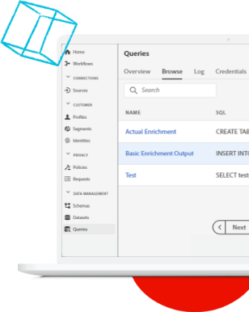

# Experience League LIVE

## Rejoignez-nous pour le prochain épisode !

Experience League LIVE est une émission produite par l’équipe d’Experience League et diffusée en direct.  Elle vous offre la possibilité d’entrer en contact avec des experts en produits Adobe et de découvrir des conseils pratiques, des astuces et des stratégies à mettre en pratique avec les applications Adobe Experience Cloud.

## Événements Experience League LIVE à venir !

<table>
<tr>
  <td>
      
     

          <strong>Parcours clients</strong>
     

     

          <em>Septembre 2021</em>
     

    

    <em>Avec les experts en produits, découvrez comment créer des expériences qui s’adaptent aux clients en temps réel</em>
    

  </td>
  <td>
      
     

          <strong>Contenu et Commerce</strong>
     

          <em>Octobre 2021</em>
     

     

    

    <em>Découvrez comment créer et gérer du contenu à grande échelle et comment créer des expériences commerciales personnalisées</em>
    

  </td>
  <td>
      
     

          <strong>Experience Platform</strong>
     

     

          <em>Décembre 2021</em>
     
    
    

    <em>Avec les experts en produits, découvrez comment créer des expériences qui s’adaptent aux clients en temps réel</em>
    

  </td>
</tr>
</table>

## Épisodes précédents

Avez-vous manqué un épisode d’Experience League LIVE ? Tout est pardonné. Regardez tous nos épisodes précédents !

<table>
<tr>

<td>
    
     

          <strong>Invités</strong> : <i>Eric Matisoff et Dasha Fitzpatrick</i>
     

     

          <em>29 juillet 2021</em>
     
    
    

    <em></em>
    

  </td>
</tr>
</table>

>[!TIP]
>
>Pour découvrir des méthodes d’apprentissage supplémentaires, consultez nos [cours](https://experienceleague.adobe.com/?lang=fr#dashboard/learning) gratuits ainsi que nos [tutoriels](https://experienceleague.adobe.com/docs/home-tutorials.html?lang=fr) individuels.
