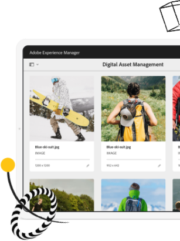

# Experience League LIVE

## Rejoignez-nous pour le prochain épisode !

Experience League LIVE est une émission en streaming produite par l&#39;équipe Experience League.  Vous avez la possibilité de vous connecter avec des experts Adobes en produits et de découvrir des conseils pratiques, des astuces et des stratégies que vous pouvez appliquer aux applications Adobe Experience Cloud.

## Événements LIVE Experience League à venir !

<table>
<tr>
  <td>
      
     

          <strong>Parcours clients</strong>
     

     

          <em>Septembre 2021</em>
     

    

    <em>Apprenez des experts produit sur la création d’expériences qui s’adaptent aux clients en temps réel</em>
    

  </td>
  <td>
      
     

          <strong>Contenu et Commerce</strong>
     

          <em>Octobre 2021</em>
     

     

    

    <em>Découvrez comment créer et gérer du contenu à grande échelle et créer des expériences commerciales personnalisées</em>
    

  </td>
  <td>
      
     

          <strong>Experience Platform</strong>
     

     

          <em>Décembre 2021</em>
     
    
    

    <em>Apprenez des experts produit sur la création d’expériences qui s’adaptent aux clients en temps réel</em>
    

  </td>
</tr>
</table>

## Épisodes passés

Avez-vous manqué un épisode d’Experience League LIVE ? Tout est pardonné. Regardez tous nos épisodes passés !

<table>
<tr>

<td>
    
     

          <strong>Invités</strong>  :  <i>Eric Matisoff et Dasha Fitzpatrick</i>
     

     

          <em>29 juillet 2021</em>
     
    
    

    <em></em>
    

  </td>
</tr>
</table>

>[!TIP]
>
>Pour découvrir des méthodes d’apprentissage supplémentaires, consultez nos [cours](https://experienceleague.adobe.com/?lang=fr#dashboard/learning) gratuits ainsi que nos [tutoriels](https://experienceleague.adobe.com/docs/home-tutorials.html?lang=fr) individuels.
