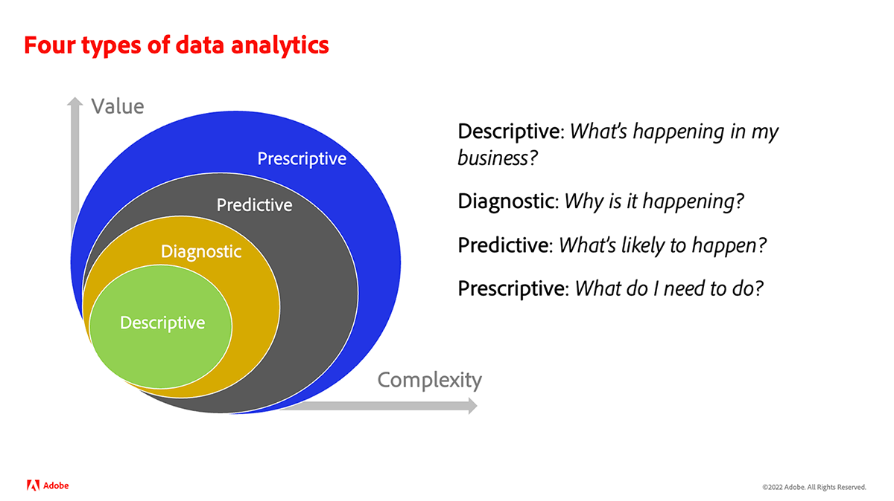
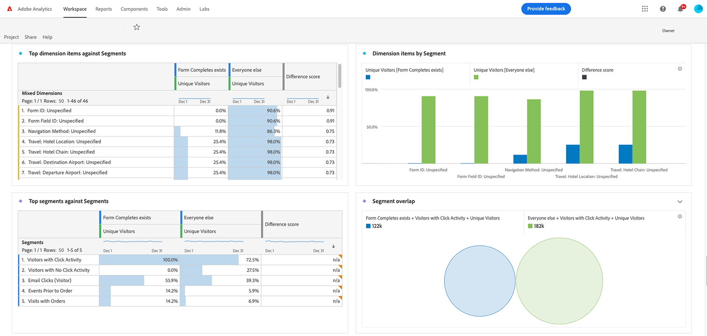

# Qu’est-ce que l’analyse ?{#what-is-analytics}

Avant de vous plonger dans le contenu d&#39;Adobe Analytics, il est utile de comprendre la réponse à cette question fondamentale « Qu’est-ce que l’analyse ? » L’analyse est un terme général qui englobe plusieurs disciplines pour stimuler le développement et la transformation des entreprises, à savoir l’analyse des données et des activités commerciales. Il existe une différence entre les deux. Regardons de plus près.

## Rôle de l’analyse commerciale

Ces dernières années, la naissance et la maturité de l’utilisation d’Internet à des fins commerciales ont explosé, tout comme la quantité de données amassées par les organisations sur la façon dont les consommateurs interagissent et adhèrent à leur marque. Si vous avez déjà entendu le terme Big Data, celui-ci relève du domaine de l’analyse commerciale.

L’analyse commerciale est un élément du Business Intelligence qui se concentre sur les risques et les opportunités stratégiques à grande échelle. Il s’agit d’une compétence nécessaire que les entreprises doivent posséder pour rester compétitives dans leur secteur.

Il existe quatre types d’analyses commerciale :

* **Descriptive** : elle implique l’utilisation de données historiques pour identifier les tendances dans l’activité d’une entreprise. Par exemple, un détaillant doit prévoir la demande de produits avant les périodes de haute activité ou de vacances et disposer d’un stock suffisant pour atteindre ses objectifs commerciaux.
* **Diagnostic** : quelles sont les raisons d’un résultat inattendu ? Pourquoi y a-t-il eu une forte demande pour un produit ou un service pendant la saison creuse ? L’analyse diagnostique est une forme plus approfondie d’analyse descriptive et vise à dégager des corrélations à partir des données.
* **Prédictive** : cette méthode utilise des données historiques pour déterminer des résultats ou des événements probables. Le machine learning et l’intelligence artificielle sont généralement utilisés pour des pronostics plus précis. L’attrition client est un exemple d’application réelle de l’analyse prédictive. Cette analyse permet de trouver des corrélations afin d’identifier les attributs des clients qui sont susceptibles de se rétracter, de sorte que vous puissiez faire quelque chose pour l’éviter.
* **Prescriptive** : il s’agit d’une forme avancée d’analyse prédictive qui vise à découvrir le meilleur moyen d’atteindre un résultat souhaité. Ce type d’analyse utilise également les technologies de machine learning et d’IA. Les détaillants utilisent l’analyse prescriptive pour augmenter leurs marges en apportant des changements à leurs activités.

## Rôle de l’analyse des données

L’analyse des données utilise de nombreuses technologies identiques à celles utilisées pour l’analyse commerciale, mais sa portée est plus large et sa nature plus technique. L’analyse des Big Data, par exemple, repose sur la qualité et l’organisation des données. Avec quelle efficacité les données sont-elles traitées, stockées et nettoyées ? Les spécialistes des données travaillent dans le domaine de l’analyse des données. Ils transforment des ensembles de données volumineux que les analystes commerciaux utilisent ensuite pour communiquer des informations à l’organisation afin d’optimiser les processus et les mesures. Les spécialistes des données étudient plus en détail les données, pour déterminer les tendances et les connexions.

## Quelle est le rôle d’Adobe Analytics ?

Adobe Analytics est une plateforme d’analyse de données performante qui collecte des données à partir d’expériences digitales multicanaux prenant en charge le parcours client et fournit des outils pour analyser ces données. Il s’agit d’une plateforme généralement utilisée par les spécialistes du marketing et les analystes commerciaux à des fins d’analyse commerciale.

Les exigences de l’entreprise, la conception et la collecte des données sont des facteurs clés pour une pratique analytique efficace. Dans un premier temps, les clients commencent par collecter des données sur les parcours client clés et les résultats commerciaux escomptés pour les expériences digitales traditionnelles, comme le Web et les appareils mobiles. Les données doivent permettre de répondre à des questions telles que :

* « Quels sont les contenus et les types de contenus les plus appréciés par les utilisateurs ? »
* « Quels sont les chemins qui génèrent des conversions à forte valeur ajoutée, comme les revenus, les réservations, les demandes ou les abonnements ? »
* « Quels produits, services ou contenus dois-je présenter aux utilisateurs habituels et nouveaux ? »
* « Quelles sont les performances des canaux de marketing digital ? »

Une fois la base de données collectée dans Adobe Analytics, les spécialistes du marketing et les analystes commerciaux utilisent divers rapports et outils de visualisation de données disponibles dans le produit pour effectuer des analyses et présenter des informations significatives sur ces données. Qui plus est, Adobe Analytics fournit des résultats sous diverses formes. Il peut s’agir d’un segment ou d’une audience envoyé à un outil d’optimisation, comme Adobe Target, pour exécuter des tests A/B. Il peut s’agir d’un score prédictif indiquant la probabilité d’une action par une personne utilisée par un autre système pour la modélisation.

Au fil du temps, les clients enrichissent les données web et mobiles traditionnelles avec d’autres sources de canal, notamment la gestion de la relation client (CRM), le centre d’appel, les briques et mortiers, les assistants vocaux, etc. Adobe Analytics offre plusieurs méthodes pour capturer des données à partir de pratiquement n’importe quelle source de canal et ainsi créer une base de données d’analyse fiable.

La collecte de jeux de données supplémentaires permet d’effectuer des types d’analyse de données normatives plus avancés, grâce au machine learning ou aux modèles de données avancés, tels que l’attribution marketing et la détection des anomalies.

Nous vous encourageons à consulter les tutoriels sur Experience League pour vous guider à travers les principaux avantages et fonctionnalités d’Adobe Analytics.
