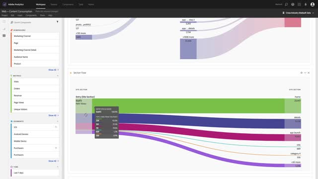

# Tutoriels Analytics

Tirez le meilleur parti d’[!DNL Adobe Analytics]. Utilisez ces tutoriels pour maîtriser les fonctionnalités d’Analytics et en faire profiter votre entreprise. Ce contenu est destiné aux administrateurs, aux analystes de données, aux spécialistes du marketing, aux développeurs et aux architectes.

Pour démarrer,

* Consultez la section **« Nouveautés »** ci-dessous pour prendre connaissance des dernières informations et fonctionnalités.
* **La sélection du personnel** met en évidence certains de nos contenus préférés.
* Découvrez le contenu par rubrique et sous-rubrique dans le **volet de navigation de gauche**.
* Utilisez le champ **recherche** en haut de la page si vous savez ce que vous souhaitez apprendre.

Des expériences d’apprentissage organisées par rôle et niveau de compétence sont également proposées dans la section Cours. Connectez-vous simplement avec votre Adobe ID et accédez à **Formation > Cours recommandés** dans le volet de navigation supérieur.

## Nouveautés

* **[Application Cartes de performance mobiles Adobe Analytics](additional-tools/analytics-dashboards/adobe-analytics-dashboards-in-app-experience.md)**
   *Découvrez comment télécharger l’application Cartes de performance mobiles et afficher les cartes de performance mobiles créées dans [!DNL Analysis Workspace].*

* **[Annotations dans Workspace (vidéo)](analysis-workspace/navigating-workspace-projects/annotations-in-analysis-workspace.md)**
   *Les annotations dans [!DNL Analysis Workspace] vous permettent de communiquer efficacement aux utilisateurs de votre organisation les nuances et insights concernant les données contextuelles. Annotez une date ou une période avec des problèmes de données connus, des jours fériés, des lancements de campagne, etc. Cela indique aux utilisateurs pourquoi des irrégularités apparaissent dans les graphiques linéaires, les tableaux, etc.*

## Sélection du personnel

<table>
<tr>
  <td>
    
    

      <a href="analysis-workspace/attribution-iq/algorithmic-model-in-attribution-iq.md">
    <strong>Modèle algorithmique dans Attribution IQ</strong>
    </a>
    

    

    <em>Le modèle d’attribution algorithmique d’Analysis Workspace utilise des techniques statistiques pour déterminer de manière dynamique la distribution optimale du crédit pour la mesure sélectionnée.</em>
    

  </td>
   <td>
    
    

      <a href="analysis-workspace/navigating-workspace-projects/training-tutorial-template-in-analysis-workspace.md">
    <strong>Modèle de tutoriel de formation dans Analysis Workspace</strong>
    </a>
    

    

    <em>Le tutoriel de formation à Analysis Workspace vous présente la terminologie et les étapes nécessaires à la création de votre première analyse dans Workspace.</em>
    

  </td>
  <td>
    
    

      <a href="analysis-workspace/analysis-workspace-basics/analysis-workspace-overview.md">
    <strong>Aperçu d’Analysis Workspace</strong>
    </a>
    

    

    <em>Présentation détaillée dʼAnalysis Workspace.</em>
    

  </td>
</tr>
</table>

## Ressources supplémentaires

[Documentation Adobe Analytics](https://experienceleague.adobe.com/docs/analytics.html?lang=fr)
