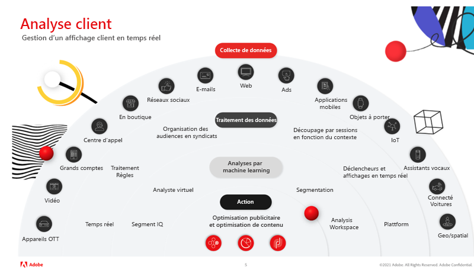

# Maîtriser l’intelligence client avec Virtual Analyst et Segment IQ dans Adobe Analytics

Dans cet article, vous découvrirez l’importance de l’utilisation de l’intelligence artificielle et du machine learning (IA/ML). Vous pourrez ensuite consulter les avantages et les témoignages concrets de clients internationaux qui utilisent Virtual Analyst et Segment IQ pour détecter les anomalies, éviter les valeurs aberrantes et optimiser le retour sur investissement.

## Les atouts de l’intelligence artificielle

Peut-être vous souvenez-vous de la fois où le champion d’échecs Garry Kasparov a été battu par [!DNL Deep Blue] d’IBM®. Les experts étaient convaincus que jamais au grand jamais une machine ne pourrait rivaliser avec la prise de décision et le jugement humains dans un jeu aussi complexe que les échecs. Pourtant, une machine a bel et bien gagné et cet événement n’est pas resté anodin, loin de là : il a provoqué un changement fondamental dans la stratégie commerciale et l’innovation technologique, car la puissance de l’intelligence artificielle a été révélée au grand jour.

Adobe Analytics est au cœur de l’intelligence client, recueillant des renseignements et permettant à tous les acteurs du monde de l’entreprise de comprendre et d’optimiser les interactions entre les clients et leur marque, et ce sur tous les points de contact, en temps réel et à grande échelle.

Les outils d’IA d’Adobe n’ont pas vocation à vous remplacer, mais plutôt à vous donner les moyens d’atteindre le plus haut retour sur investissement possible et de récolter le fruit de vos efforts.

## Faire évoluer vos analyses

Pour faire évoluer vos analyses, il faut se concentrer sur trois domaines clés :

1. Organisation : comment créer des vues holistiques des clients, favoriser la prise de décisions éclairées et démocratiser les données.

1. Technologie : comment s’assurer que les données et la technologie disposent des fondements pour une personnalisation à grande échelle.

1. Client : comment créer de la confiance et s’adapter au changement.

Les analyses sont une tâche ardue. Pour obtenir des insights, il faut y consacrer le temps nécessaire. Or la demande pour les obtenir plus rapidement se fait toujours plus pressante. Les principaux problèmes rencontrés par les organisations sont les suivants :

* Ressources organisationnelles limitées : les multiples objectifs commerciaux peuvent limiter la disponibilité des ressources
* Expertise technique limitée : les connaissances peuvent-elles être partagées et les données démocratisées ?
* Attentes des clients : votre équipe peut-elle réagir de manière dynamique aux changements de comportement des clients ?

## Devenir expert en intelligence client grâce à l’assistant virtuel, optimisé par Adobe Sensei

### 3 étapes de l’intelligence client

Pour établir une stratégie d’intelligence client efficace, nous devons passer par 3 étapes (consultez l’image 1 ci-dessus), à savoir : (a) la collecte de données, (b) le traitement des données, (c) les analyses et le machine learning. Ce n’est qu’à l’issue des ces 3 étapes que nous pouvons enfin agir et optimiser notre contenu et publicités.

1. La collecte de données dépend de votre organisation et peut comprendre plusieurs canaux et supports. Il s’agit notamment des appareils OTT, de la vidéo, des entreprises, des centres d’appels, des magasins, des e-mails et réseaux sociaux, du Web, des publicités, des applications mobiles, de la technologie portable, de l’IoT, des assistants vocaux, des cartes connectées et des systèmes géo/spatiaux.

1. Le traitement des données comprend la collecte de données en temps réel, les règles de traitement, la syndication des audiences, la sessionnalisation en fonction du contexte, les déclencheurs et affichages en temps réel et la plateforme.

1. Les analyses et le machine learning comprennent Segment IQ, Virtual Analyst, la segmentation et Analysis Workspace

### Tirer parti de votre outil Virtual Analyst

Pensez à l’outil [Virtual Analyst](https://experienceleague.adobe.com/docs/analytics/analyze/analysis-workspace/virtual-analyst/overview.html?lang=fr) comme à l’analyste star qui :

* Ne quitte jamais le bureau, car il n’en a pas besoin
* Connaît les tenants et aboutissants de votre activité sur le bout des doigts
* Agit instantanément en cas d’alerte intelligente émise par la surveillance des anomalies 24h/24, 7j/7, et ce sur toutes les données
* Est capable de réorganiser les composants pour [!UICONTROL Analysis Workspace]

### Découvrez les opportunités derrière les données

* Bénéficiez d’une visibilité à la minute près sur le statut des KPI marketing
* Réalisez des investissements marketing judicieux de manière fiable et prévisible
* Répondez et dépassez les attentes des clients

### Témoignages

L’analyste virtuel a mis au jour les scénarios suivants pour des clients réels d’Adobe :

* Fin de la campagne : augmentation quotidienne des recettes de 1,7 million de dollars, principalement due à une campagne qui avait été interrompue prématurément.
* Bug chez le fournisseur : augmentation de 73 % des retraits de produits du panier due à un bug du gestionnaire de balises qui retirait automatiquement certains produits du panier.
* Problème de navigateur : augmentation de 8 % des abandons de panier imputable aux navigateurs Chrome. Ce correctif a permis d’augmenter les recettes de 1,2 million de dollars par jour.
* Fraude aux coupons : identification d’une hausse de 81 % des commandes causée par le trafic référencé par deux grands sites d’offres et de coupons quotidiens promouvant des coupons de produits de toilette frauduleux. Ces commandes ont pu être annulées.
* Espionnage d’entreprise : augmentation de 200 % des visites causée par un robot créé par leur principal concurrent pour récupérer le contenu de leur site et le réutiliser. Ces adresses IP ont pu être bloquées.

## Fonctionnalités d’Adobe Analytics

[Détection des anomalies](https://experienceleague.adobe.com/docs/analytics/analyze/analysis-workspace/virtual-analyst/anomaly-detection/anomaly-detection.html?lang=fr) :

* Utilisez des algorithmes prédictifs intégrés pour identifier les pics et les creux dans vos données dont vous ignoriez l’existence.
* Utilisez les 28 algorithmes uniques pour identifier les anomalies, y compris les modèles de saisonnalité, de croissance et cycliques, ainsi que la concordance avec les vacances.
* Réduisez la dépendance à l’égard de l’ingénieur de données et libérez les capacités des ingénieurs de données sur les individus.

[Analyse des contributions](https://experienceleague.adobe.com/docs/analytics/analyze/analysis-workspace/virtual-analyst/contribution-analysis/ca-tokens.html?lang=fr) :

* Identifiez rapidement les facteurs déterminants à l’origine de changements importants dans vos données.
* Économisez d’innombrables heures à chercher des explications aux changements dans les mesures.
* Tirez parti d’un machine learning puissant, conçu pour transformer l’analyste et le professionnel du marketing en un ingénieur de données.

[Alertes intelligentes](https://experienceleague.adobe.com/docs/analytics/analyze/analysis-workspace/virtual-analyst/intelligent-alerts/intellligent-alerts.html?lang=fr) :

Restez informé des anomalies dans vos données à tout moment, que vous soyez au bureau ou en déplacement.

* Créez des alertes directement depuis Analysis Workspace.
* Basez les règles sur les anomalies (90 %, 95 %, 99 %), le pourcentage de changement et les valeurs supérieures ou inférieures.
* Utilisez la [!UICONTROL Prévisualisation des alertes] pour déterminer la fréquence de déclenchement d’une alerte.
* Tirez parti de l’assistance par SMS et par e-mail avec des liens vers des projets [Analysis Workspace](https://experienceleague.adobe.com/docs/analytics/analyze/analysis-workspace/home.html?lang=fr) générés automatiquement.

[Segment IQ](https://experienceleague.adobe.com/docs/analytics/analyze/analysis-workspace/segment-iq.html?lang=fr) :

* Découvrez les différences et les chevauchements entre vos segments et peaufinez votre stratégie de segmentation.
* Découvrez les principales caractéristiques des segments d’audience qui pilotent vos indicateurs clés de performance.
* En quelques minutes, voire quelques secondes, obtenez des rapports et des visualisations qui affichent les points communs entre les dimensions, les mesures et les autres segments.
* Améliorez l’engagement des clients à forte valeur ajoutée.

## Témoignages sur l’utilisation de Segment IQ

**Mobile ou poste de travail :** « Nous avons comparé les accès d’un de nos sites à un autre et nous avons rapidement trouvé un grand nombre d’incohérences au niveau des balises ». → Évitez les problèmes liés aux données avant le lancement d’un produit

**Utilisation de la fonctionnalité :** « Les clients qui avaient recours à notre fonctionnalité de comparaison de produits étaient 10 % plus susceptibles de convertir leur visite en achat. Le déplacement de la fonctionnalité en haut de la page a permis d’augmenter les commandes ». → Augmentation de 4 % de la conversion

**Engagement du contenu :** « Nous avons constaté que les visiteurs de notre section d’actualités étaient deux fois plus susceptibles de regarder des publicités vidéo. Nous avons donc ajouté d’autres options vidéo à cette section ». → Augmentation de 7 % du nombre de publicités vidéo visionnées

**Référencement payant :** « Les visiteurs provenant des moteurs de recherche étaient trois fois plus susceptibles d’acheter des produits ou services supplémentaires. En conséquence de quoi, nous avons augmenté nos dépenses sur des mots-clés spécifiques ». → Augmentation de 56 % des ventes incitatives

**Rupture de stock de produits :** « Les personnes qui achetaient des objets connectés Fitbit étaient six fois plus susceptibles de tomber sur un produit en &#39;rupture de stock&#39; que tous les autres clients. Nous avons donc rapidement commandé plus d’articles Fitbit ». → Ruptures de stock évitées et plus de commandes en période de fêtes réalisées.

Pour plus d’informations, regardez notre [webinaire](https://adobecustomersuccess.adobeconnect.com/pmetho6ivh68/).

Pour en savoir plus sur la stratégie et le leadership éclairé, consultez nos ressources dédiées au [Succès client](https://experienceleague.adobe.com/docs/customer-success/customer-success/overview.html?lang=fr).